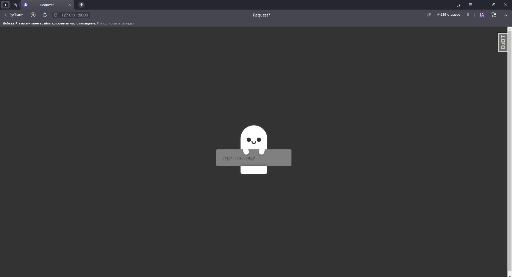
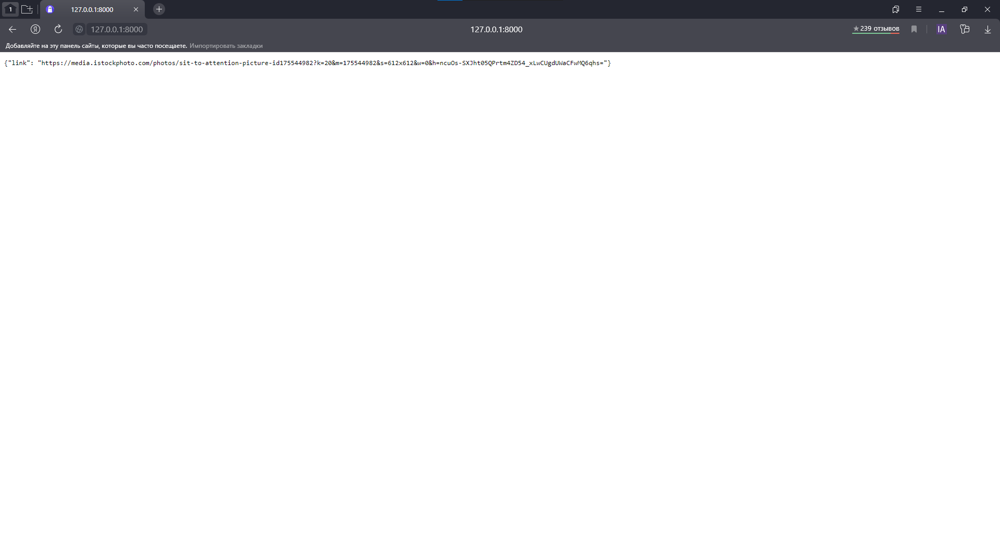

## _Рандомная картинка по запросу_

### Для установки: 

* Создать виртуальную среду:

Это для Windows:

```
python -m venv venv
```

* Запустить виртуальную среду:

```
venv\Scripts\activate
```

* Скачать зависимости с requirements.txt:

```
pip install -r requirements.txt
```

* Создать файлик .env в корне проекта и в него положить некоторые переменные:

##### Обязательные: 
SECRET_KEY=

DEBUG_VALUE=

DJANGO_DEV=

##### Для базы данных postgreSQL:

NAME=

USER=

PASSWORD=

HOST=

PORT=


* Перейти в папку _random_api_json_:

```
cd random_api_json
```

* Запустить сервер:

```
python manage.py runserver
```

### Через Docker:

#### Добавить все переменные в docker-compose.yml

```
POSTGRES_DB=
POSTGRES_USER=
POSTGRES_PASSWORD=

DB_NAME=
DB_USER=
USER_PASSWORD=
DB_HOST=
DB_PORT=
SECRET_KEY=
DEBUG_VALUE=
DJANGO_DEV=
```

### Запустить `docker-compose up` в директории проекта.

### Скриншот главной страницы:


### Json ответ:
